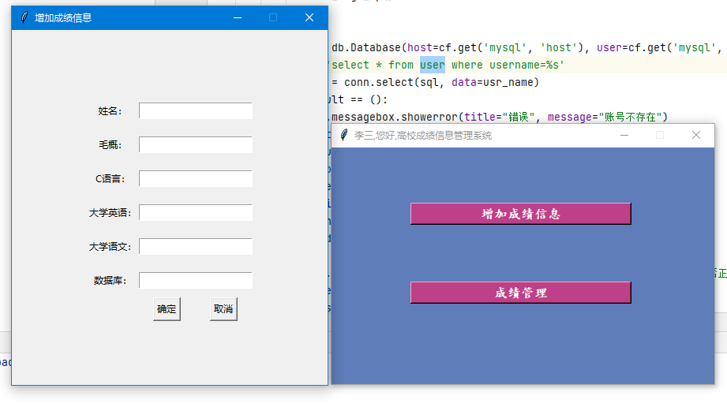

# cjgl
## 学生成绩管理系统

系统流程图

功能框架图 

运行环境:
window10 64位操作系统 + cpu inter（R） i5-9500 3.00GHZ + 硬盘250G + 内存 16G

Python:版本
Python3.x

系统时需要安装pymysql 和tkinter库

PyMySQL 是在 Python3.x 版本中用于连接 MySQL 服务器的一个库，Python2 中则使用 mysqldb。

tkinter是Python GUI开发的一个标准库。

我们编写的Python代码会调用内置的Tkinter，Tkinter封装了访问Tk的接口；
Tk是一个图形库，支持多个操作系统，使用Tcl语言开发；
Tk会调用操作系统提供的本地GUI接口，完成最终的GUI。